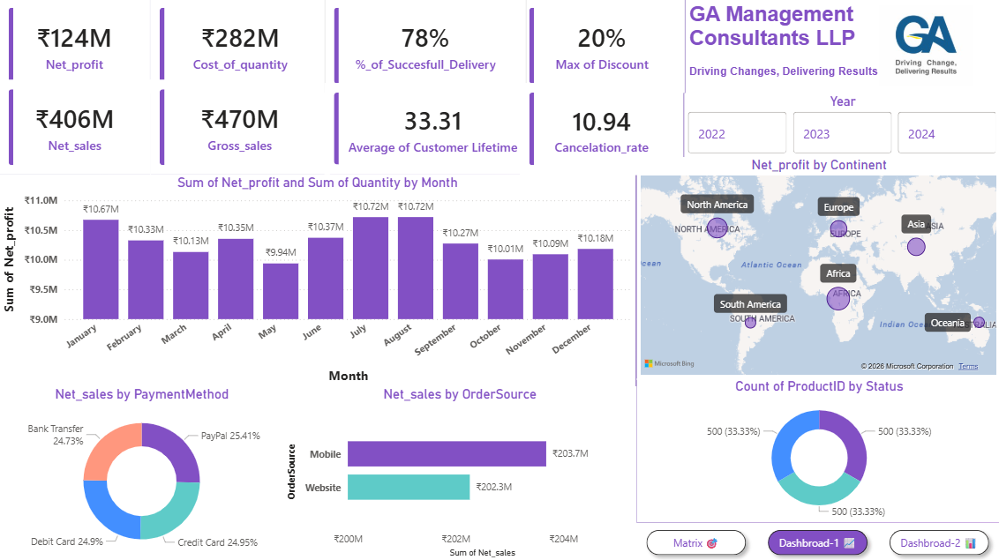
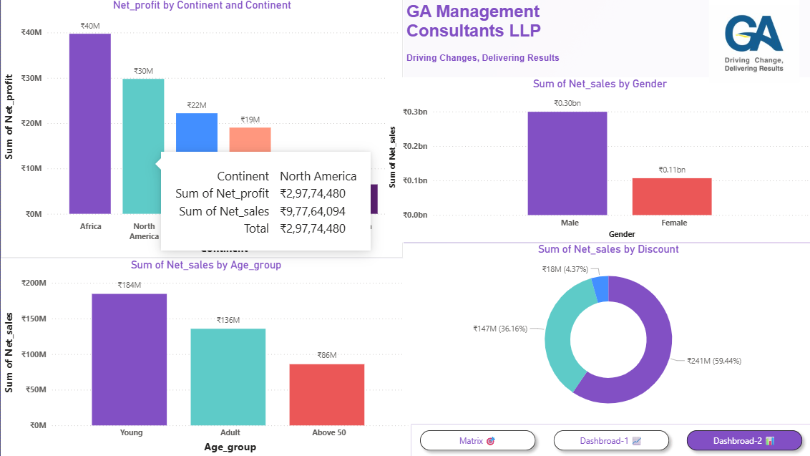
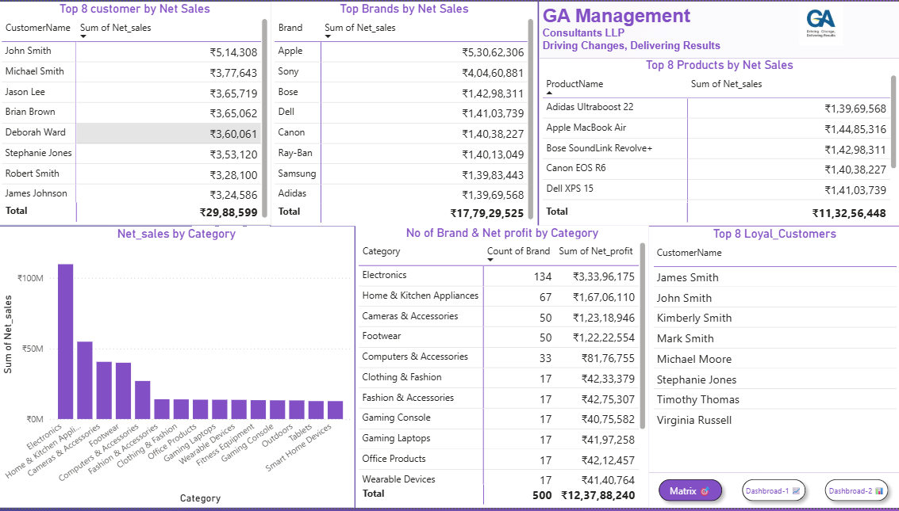

# 🛒 E-Commerce Business Intelligence Dashboard

> **GA Management Consultants LLP** — *Driving Changes, Delivering Results*

A comprehensive **Power BI dashboard** built on e-commerce transaction data, providing actionable insights across sales performance, customer behaviour, product analytics, and geographic distribution.

---

## 📊 Dashboard Preview

### Dashboard 1 — Executive Overview


### Dashboard 2 — Demographic & Discount Analysis


### Matrix — Product & Customer Rankings


---

## 📁 Project Structure

```
├── Project_dashboard.pbix          # Main Power BI file
├── customers_Data.xlsx             # Raw customer data
├── products_Data.xlsx              # Raw product catalogue
├── Transactions.xlsx               # Raw transaction records
├── Business_insights_summary.docx  # Key business insights report
├── Power_Query_documentation.docx  # Data transformation documentation
└── README.md
```

---

## 🗄️ Data Model

The project uses a **star schema** with four tables:

```
customers ──(1:*)── ecommerce_transactions ──(*:1)── products
                              │
                           (1:*)
                              │
                           Calendar
```

| Table | Rows | Key Columns |
|-------|------|-------------|
| `customers` | 999+ | CustomerID, CustomerName, Country, Continent, Age, Age_group, Customer_Lifetime |
| `ecommerce_transactions` | 999+ | TransactionID, CustomerID, ProductID, Quantity, Net_sales, Net_profit, Gross_sales, Discount, Status, OrderSource, PaymentMethod |
| `products` | 500 | ProductID, ProductName, Brand, Category, Price, StockQuantity, product Code |
| `Calendar` | 1,461 | Date (2021–2024) |

---

## 🔧 Power Query Transformations

### 1. Customers Data
- Changed `RegistrationDate` datatype to Date
- Split `RegistrationDate` column to separate **Date** and **Time**
- Corrected column names and removed blank columns

### 2. Products Data
- Removed `Subcategory` and `Product Color` columns
- Split product code out of `product details` column
- Merged categories for consistency:
  - `Cameras` → `Cameras & Accessories`
  - `Kitchen Appliances` → `Home & Kitchen Appliances`
  - `Home & Kitchen` → `Home & Kitchen Appliances`
  - `Gaming` → `Gaming Console` *(PS5 only)*
  - `Sports & Outdoors` → `Footwear` *(sport shoes only)*

### 3. Transactions
- Changed `TransactionDate` datatype to Date
- Removed blank columns
- Fixed text values:
  - `PayPal#` → `PayPal`
  - `completed` → `Completed`
  - `Web` → `Website`

### 4. Calendar Table
- Created a continuous date table spanning the full transaction date range (2021–2024)
- Marked as date table in Power BI

---

## 📈 Key Business Metrics

| Metric | Value |
|--------|-------|
| 💰 Net Profit | ₹123.79M |
| 🏷️ Gross Sales | ₹470.30M |
| 📦 Net Sales | ₹405.95M |
| 🏭 Cost of Goods | ₹282.16M |
| ✅ Delivery Success Rate | 78% |
| 🔖 Max Discount | 20% |
| 🔄 Cancellation Rate | 10.94 |
| 🕐 Avg. Customer Lifetime | 33.31 months |

---

## 💡 Key Business Insights

- **Most profitable months:** January, July, and August
- **Top continent by sales:** Africa (₹40M net profit)
- **Payment methods** are nearly equally distributed across PayPal, Bank Transfer, Debit Card, and Credit Card (~25% each)
- **Mobile** drives more sales than Website (₹203.7M vs ₹202.3M)
- **Younger customers** make up the largest age segment (₹184M in net sales)
- **Male customers** account for the majority of net sales (₹0.30bn vs ₹0.11bn)

---

## 🏆 Top Performers

### Top Brands by Net Sales
| Brand | Net Sales |
|-------|-----------|
| Apple | ₹5,30,62,306 |
| Sony | ₹4,04,60,881 |
| Bose | ₹1,42,98,311 |
| Dell | ₹1,41,03,739 |
| Canon | ₹1,40,38,227 |

### Top Products by Net Sales
| Product | Net Sales |
|---------|-----------|
| Apple MacBook Air | ₹1,44,85,316 |
| Bose SoundLink Revolve+ | ₹1,42,98,311 |
| Dell XPS 15 | ₹1,41,03,739 |
| Canon EOS R6 | ₹1,40,38,227 |
| Adidas Ultraboost 22 | ₹1,39,69,568 |

### Top Loyal Customers
James Smith · John Smith · Kimberly Smith · Mark Smith · Michael Moore · Stephanie Jones · Timothy Thomas · Virginia Russell

---

## 🗺️ Geographic Distribution (Net Profit)

| Continent | Net Profit |
|-----------|------------|
| Africa | ₹40M |
| North America | ₹30M (₹2,97,74,480) |
| Europe | ₹22M |
| Asia | ₹19M |
| South America | — |
| Oceania | — |

---

## 🛠️ Tools & Technologies


- **Power BI Desktop** — Report development and visualisation
- **Power Query (M Language)** — Data cleaning and transformation
- **DAX** — Calculated columns and measures
- **Microsoft Excel** — Source data files

---

## 🚀 Getting Started

1. Clone or download this repository
2. Open `Project_dashboard.pbix` in **Power BI Desktop**
3. If prompted, update the data source paths to point to the `.xlsx` files in your local directory:
   - `customers_Data.xlsx`
   - `products_Data.xlsx`
   - `Transactions.xlsx`
4. Click **Refresh** to reload data
5. Explore the three report pages: **Dashboard-1**, **Dashboard-2**, and **Matrix**

---

## 📋 Report Pages

| Page | Description |
|------|-------------|
| **Dashboard-1** | Executive KPIs, monthly profit trend, payment method split, order source comparison, and geographic map |
| **Dashboard-2** | Profit by continent, net sales by age group, gender breakdown, and discount tier analysis |
| **Matrix** | Top 8 customers, top 8 brands, top 8 products, category profitability, and loyal customer list |

---

## 👤 Author

**GA Management Consultants LLP**
*Driving Changes, Delivering Results*

---

## 📄 License

This project is for internal business use by GA Management Consultants LLP.
